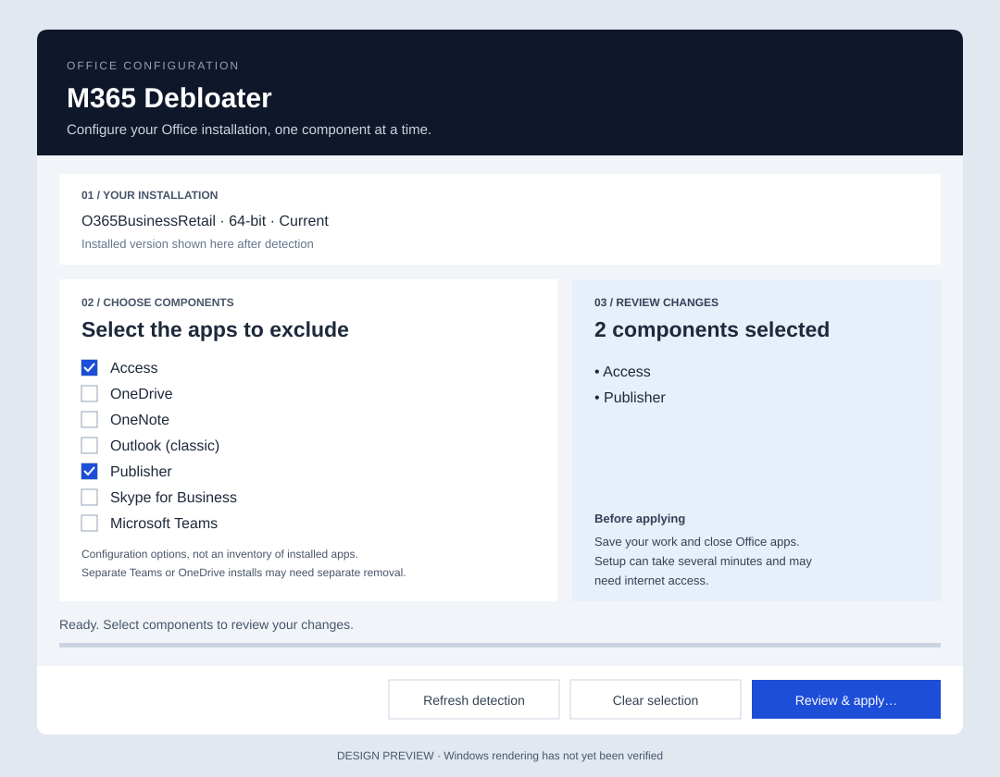

# M365 Debloater


Reconfigure Microsoft 365 at the installation level using Microsoft's Office Deployment Tool (ODT).

M365 Debloater changes which Office components are installed. It asks Office setup to apply a reduced configuration, rather than hiding apps, shortcuts or Start menu entries. ODT handles the installation changes; this application makes the selection and review explicit.

**Detect your installation → choose components → review and apply.**

The interface shows the detected Office edition, architecture and channel alongside a selection summary. Nothing is selected by default, and applying changes requires confirmation. The application uses English interface text.



*Design preview, not a Windows runtime screenshot. Rendering and scaling still need validation on Windows.*

## What it does

- Reads the existing Click-to-Run installation from the Windows registry.
- Automatically prepares missing Office Deployment Tool after detecting a supported installation, checking the downloaded installer's Microsoft signature.
- Offers exclusions for Access, OneDrive, OneNote, classic Outlook, Publisher, Skype for Business and Teams.
- Retains exclusions recorded for the detected product, including components outside the selection list.
- Requests the detected architecture and channel, with the installed version and languages.
- Runs `setup.exe /configure` after confirmation and reports its exit result.

This is an Office reconfiguration utility. It does not perform a full uninstall/reinstall, enforce Group Policy, remove arbitrary Windows apps, or guarantee that separately installed Teams and OneDrive clients are removed. The selection list represents configuration options; it is not an inventory of installed apps. New Outlook is separate from classic Outlook.

ODT controls the actual outcome. Existing exclusions matter because a configuration matching all installed languages can replace previous exclusion settings. See Microsoft's [configuration reference](https://learn.microsoft.com/en-us/microsoft-365-apps/deploy/office-deployment-tool-configuration-options) for `ExcludeApp`, `MatchInstalled` and `FORCEAPPSHUTDOWN` behavior.

## Run on Windows

You need Windows with .NET Framework 4.7.2 or later, a recognized Office Click-to-Run installation, Office Deployment Tool, and administrator approval to apply changes. Internet access may be needed by Office setup.

1. Build the application as described below and open `M365Debloater.exe`.
2. If `%TEMP%\odt\setup.exe` is missing, the application automatically downloads ODT from Microsoft, verifies the installer signature and extracts it. Internet access and Windows PowerShell 5.1 are required for this preparation. An existing ODT is reused.
3. Check the installation details. Use **Refresh detection** if Office or ODT was prepared after opening the application.
4. Select components to exclude and inspect the summary. Previously recorded exclusions are retained automatically.
5. Save your work, close Office apps, and choose **Review & apply…**. Review the confirmation before continuing.
6. Wait for Office setup to exit. On success, verify your Office applications. On failure, inspect the reported exit code and ODT logs in `%TEMP%` before retrying.

The progress indicator shows ODT preparation or Office setup activity; it does not estimate completion. The app does not forcibly close Office apps or restart Windows. Closing its window is blocked while preparation or setup is running. Downloading ODT does not apply changes to Office; applying your selection requires a separate confirmation.

### If ODT cannot be prepared

The status area reports preparation errors. Check your internet connection and access to Microsoft's download servers, then choose **Refresh detection** to retry. Apply remains disabled until preparation succeeds.

For manual preparation, download the [Office Deployment Tool from Microsoft](https://www.microsoft.com/en-us/download/details.aspx?id=49117), extract it and place its `setup.exe` in `%TEMP%\odt` for the account running the app. Then choose **Refresh detection**. The downloaded `officedeploymenttool_*.exe` is an extractor, not the `setup.exe` used by this application.

### Optional launcher

After building locally, you can also let the PowerShell helper download and extract ODT. Run from Windows PowerShell 5.1:

```powershell
.\scripts\Start-M365Debloater.ps1
# Or use a specific local build:
.\scripts\Start-M365Debloater.ps1 -ApplicationPath C:\Tools\M365Debloater.exe
# Prepare ODT without opening the application:
.\scripts\Start-M365Debloater.ps1 -PrepareOnly
```

The helper downloads ODT from Microsoft, checks its installer signature and opens your local application. It does not download or execute a GitHub release. Its console stays visible so preparation failures can be diagnosed. ODT remains in `%TEMP%\odt` for later use.

### Detection boundaries

Recognized product IDs: `O365ProPlusRetail`, `O365BusinessRetail`, `ProPlus2019Retail`, `ProPlus2021Retail`, and `ProPlus2024Volume`. These are detection rules, not a tested compatibility matrix.

The application recognizes Current, Monthly Enterprise, Semi-Annual, their applicable Preview identifiers, and Beta. LTSC 2024 uses `PerpetualVL2024`. Missing or unknown architecture/channel information, multiple recognized suites, and unrecognized existing exclusion IDs block Apply instead of guessing. MSI installations are outside this workflow. Channel identifiers follow [Microsoft's channel mapping](https://github.com/MicrosoftDocs/memdocs/blob/main/intune/configmgr/sum/deploy-use/manage-office-365-proplus-updates.md).

## Build

Use Visual Studio with **.NET desktop development** and the **.NET Framework 4.7.2 targeting pack**, or a Developer Command Prompt:

```powershell
msbuild .\M365-Debloater\M365-Debloater.csproj /p:Configuration=Release
```

Output: `M365-Debloater\bin\Release\M365Debloater.exe`.

Open `M365-Debloater.slnx` in a Visual Studio version that supports that solution format, or open the nested `.csproj` directly.

### Repository map

| Path | Purpose |
| --- | --- |
| `M365-Debloater/MainForm.Layout.cs` | Interface layout and visual styling |
| `M365-Debloater/MainForm.cs` | Detection, confirmation and operation state |
| `M365-Debloater/OfficeConfiguration.cs` | Component identifiers and ODT configuration |
| `M365-Debloater/Assets/` | Application logo, Windows icon and generation prompt |
| `tests/ConfigurationChecks/` | Portable checks for configuration behavior |
| `docs/windows-validation.md` | Manual validation before releasing a Windows build |
| `scripts/Start-M365Debloater.ps1` | Prepare ODT and launch a local build |

The solution builds one application from `M365-Debloater/`. The ODT preparation script, logo and window icon are embedded in the executable; no separate asset folder or script is required beside the built application. Build outputs, IDE caches and local settings are excluded from version control.

## Validation

Portable configuration checks require the .NET 10 SDK and do not invoke Office, PowerShell, the registry or Windows processes:

```sh
dotnet run --project tests/ConfigurationChecks
```

They cover product detection, rejection of incomplete configuration, preservation of existing exclusions, OneDrive identifiers and generated XML. They do not validate the WinForms interface or ODT execution. Use the [Windows validation checklist](docs/windows-validation.md) for those checks.

## Limitations and recovery

There is no automatic rollback or guarantee that organization policies will preserve these exclusions. Reintroducing components requires a separate Office configuration or installation workflow. The application reads registry configuration but does not write exclusion policy keys itself. It displays status and exit codes; it does not create a separate persistent application log.

This is an independent project, not a Microsoft product. Microsoft 365 and Office remain subject to their own licensing terms.
